# ABSA
AIKU 2023-Summer Project: Aspect Based Sentimental Analysis

## Introduction

### Problem Identificaiton

- NLP의 기본 task 중 감성 분석은 한 문장에 대해서 문장이 긍정적인지, 부정적인지(혹은 중립적인지)를 판단하는 task이다. 그러나 아래 예시처럼 한 문장 안에는 여러가지 감성이 혼합되어 나타나는 경우가 더 많다. ‘예쁘다’라는 말은 긍정적인 의미를 가지고 있는 반면, ‘비싸다’라는 말은 부정적인 의미를 가지고 있다. 이처럼 우리 실생활의 다양한 발화를 이해하고 해석하기 위해서는 문장을 더 세부적으로 살펴보고 감성 분석을 할 필요성이 있다. 이를 해결하기 위한 기법 중 하나로 속성 기반 감성 분석의 방법을 제시한다.

- 속성 기반 감성 분석(Aspect Based Sentimental Analysis)는 다시 2가지의 하위 task로 분리된다.

  - 속성 범주 탐지(Aspect Category Detection, ACD) - 문장 안에는 여러가지 속성에 대한 발화가 포함되어 있다. 이처럼 문장 안에 포함되어 있는 속성을 탐지하는 task이다.
    - ‘예쁘다’ → (제품 전체#디자인), ‘비싸다’ → (제품 전체#가격)
  - 속성 감성 분류(Aspecet Sentiment Classification) - 앞 서 속성을 모두 찾아냈다면 문장 안에서 해당 속성에 대한 감성을 분류하는 task이다.
    - ‘예쁘다’ → (제품 전체#디자인, 긍정), ‘비싸다’ → (제품 전체#가격, 부정)

  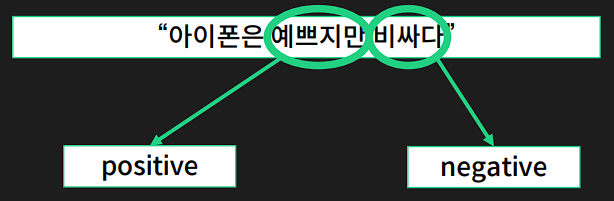

### Objective

- 속성 기반 감성 분석 task에 대해 이해하고 모델을 직접 구현

- 프로젝트의 성공 기준으로는 국립국어원의 인공지능 언어 능력 평가 과제 중 속성 기반 감성 분석 과제의 리더보드 활용

  - task를 이해하는 것이 가장 큰 목표로 다른 팀들의 점수를 확인 후 비슷한 점수로 1차 목표 설정
  - 1차 목표 달성 시, 리더보드 1등을 2차 목표로 설정

  ​

### Dataset

- 국립국어원에서 제공하고 있는 속성 기반 감성 분석 데이터셋 활용

  - 데이터의 형태는 input으로 문장을, output으로는 해당 문장에 포함되어 있는 모든 (ACD, ASC)의 쌍을 튜플 형태로 반환

    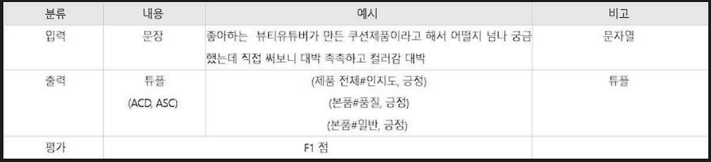

  - 해당 데이터셋의 카테고리는 (개체#속성)의 형태로 이루어져 있으며 일부 존재하지 않는 데이터를 제외하고 25개의 label이 존재

    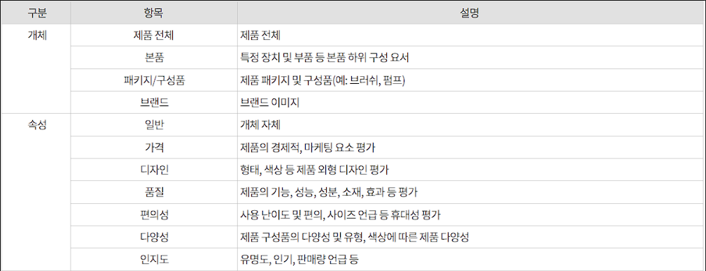

## Methodology

### Modeling

1. Baseline

   - Categroy Detection 수행 이후, 문장 안에 포함되어 있는 속성에 대해서 다른 모델로 Sentiment Classificaiton을 수행

   - Input은 문장과 25개의 label을 각각 하나씩 쌍으로 만든 형태, 하나의 문장에 대해서 총 25개의 input이 필요함

     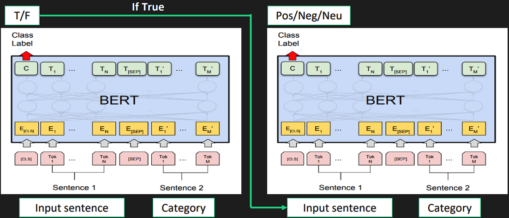

2. Joint task (Add one dimension) - Failure

   - Baseline처럼 두 단계로 분류하는 것이 아니라 Input으로 똑같이 문장과 label을 쌍으로 주되, 기존에 False에 해당하는 label은 ‘n/a’로 분류하고 True로 해당하는 것은 한 단계 거쳐가지 않고 바로 ‘Pos/Neg/Neu’를 분류하도록 모델을 구현

   - 모델이 하나인 대신, 분류해내는 output의 label이 ‘Pos / Neg / Neu / n/a’로 총 4가지

   - 그러나, 데이터셋의 분포 상 한 문장에 대해서 1~2가지 속성만 가지고 있기 때문에 나머지 2n개의 label의 정답이 모두 ‘n/a’가 됨에 따라 모델이 모든 결과를 ‘n/a’로 예측하게 됨

     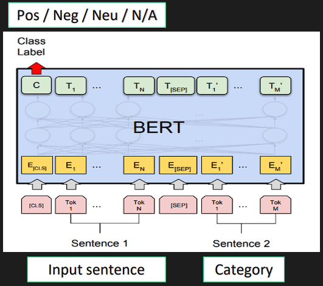

3. Seq2Seq Approach - Failure

   - Seq2Seq 모델을 활용해 인코더의 input으로는 문장만을, 디코더의 output으로는 ‘<Category>에 대한 감성은 <Sentiment>입니다’의 형식으로 출력하도록 학습

   - SC task에만 활용해보고, Joint task로 바꿔서 활용해봤으나 두 가지 전부 결과가 좋지 않음

   - 영어 모델에 비해 한국어 언어에 대한 pretrained knowledge가 부족하다고 예상했으며 데이터셋이 특정 카테고리와 긍정적인 리뷰가 많은 불균형이 심한 데이터셋이라 학습이 잘 되지 않음

     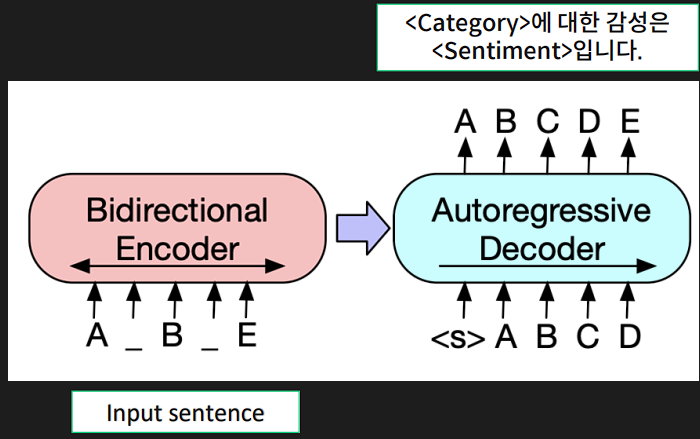

4. Multi-label Classifier

   - 한 문장에 대해서 25개의 input으로 학습하고 추론하기에는 시간적인 측면에서 지나치게 비효율적임. 이를 Multi-label Classifier로 해결

   - 추가적으로 label에 따라 Attention을 다르게 계산하는 방법을 사용, label마다 attention해야할 부분이 서로 다를 수 있기 때문

     - 그러나 여기서는 데이터셋의 개수가 적기 때문에 25개의 label에 모두 다른 attention을 적용하게 되면 학습이 잘 되지 않을 것이라고 예상
     - label이 (개체#속성)으로 이루어져 있기 때문에 개체별로 다른 attention을 적용 후, 각각의 결과를 Classifer의 input으로 사용

     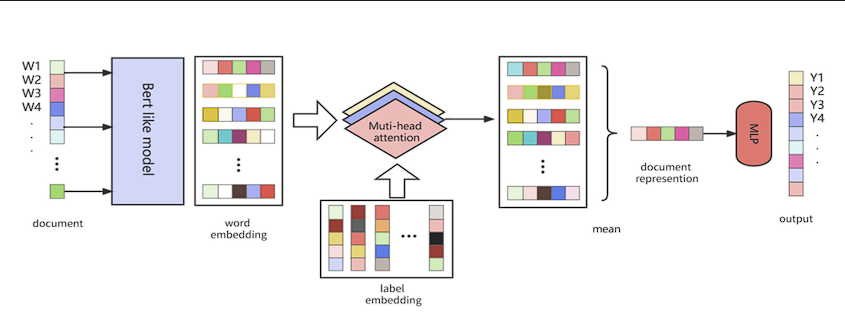

5. 기타

   - KcELECTRA로 모델 변경
     - Baseline은 RoBERTa를 사용했는데 데이터셋이 제품에 대한 리뷰이므로 구어체가 많음
     - KcELECTRA는 온라인 뉴스의 댓글과 대댓글을 수집해 학습한 모델로 정제되지 않은 구어체 및 신조어를 처리하는데 뛰어날 것이라고 판단
   - 일반적인 감성 분석 데이터로 학습된 모델에 finetuning
     - 대체로 한 리뷰에 여러 가지 감성이 복합적으로 나타나는 경우가 드물기 때문에 단순히 전체 문장을 하나의 label로 분류하는 모델의 지식을 활용해 finetuning하면 결과가 좋을 것이라고 판단
     - 그러나 한국어 감성 분석 모델 중 ‘Positive’, ‘Negative’, ‘Neutral’의 3가지 label로 학습된 모델이 존재하지 않음

### Dataset

1. Dataset 분석

   - 하나의 리뷰를 여러 개의 문장으로 나누어 데이터셋을 구성

     - 학습 데이터가 3000개로 이미 적은 상황에서 데이터들이 같은 내용을 공유한다면 모델이 overfitting되기 쉬울 것이라고 판단

   - 데이터 불균형 문제가 심각

     - 데이터 전체가 2가지 label에 대한 데이터가 대부분이며, 데이터가 오직 1개만 존재하는 label도 있음
     - 감성에 대해서는 95% 이상의 데이터가 ‘Positive’인 데이터

     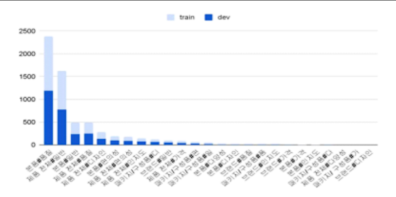

2. Preprocessing

   - Test 데이터에 존재하지 않는 이모티콘 삭제
     - 학습 데이터에는 이모지/이모티콘이 다수 존재
     - 이모지/이모티콘이 감성을 분류하는데 도움이 될 수 있지만 Test 데이터셋에는 ‘♥’를 제외하고 존재하지 않기 때문에 Test 데이터셋에 대한 결과를 예측하는데는 방해가 될 수 있음
   - 반복 어구 축약
     - ‘ㅋㅋㅋㅋ’ → ‘ㅋㅋ’ , ‘!!!!!!!!!!!’ → ‘!!’ 등 2개 이상 반복되는 문자열 제거
     - 반복 어구에 Overfitting되는 것을 방지

3. Augmentation - 적은 양의 데이터셋 문제 해결

   - KorEDA - Text Augmentation 기법인 EDA를 한국어에 적용해 놓은 기법

     - Synonym Replacement - 특정 단어를 유의어로 교체
     - Random Insertion - 임의의 단어를 삽입
     - Random Swap - 문장 내 임의의 두 단어의 위치를 바꿈
     - Random Deletion - 임의의 단어를 삭제

     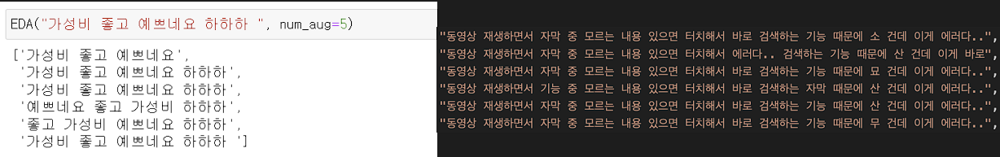

   - Backtranslation - 원본을 다른 언어로 번역 후 다시 한국어로 번역

     - 영어, 중국어, 일본어, 스페인어의 총 4가지 언어로 진행

     - 의미적으로는 동일하나 표현만 조금씩 다른 데이터셋

       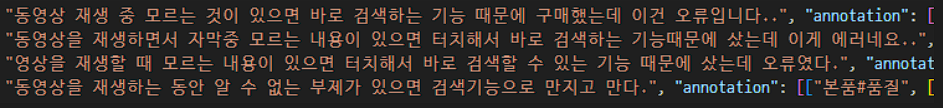

4. Imbalanced Dataset

   - 데이터의 개수가 적기 때문에 Under sampling은 좋지 않은 방법임
   - Loss - Cross Entropy Loss를 사용할 때 weight를 설정해 데이터가 많은 label에 대해서는 loss를 작게, 데이터가 적은 label에 대해서는 loss를 크게 적용
     - 많은 데이터보다 적은 데이터를 못 맞췄을 때 더 큰 penalty를 줌으로써 적은 데이터도 잘 맞출 수 있도록 학습
   - 외부 데이터 사용
     - SC task는 데이터에 한 문장 안에 서로 다른 감성이 복합적으로 나타나는 경우가 거의 없기 때문에 일반 감성 분석 데이터를 추가로 사용해 감성 분석에 대한 일반적인 지식을 늘릴 수 있을 것을 기대
     - CD task는 같은 label을 가진 데이터셋을 찾는 것이 불가능

## Result

------

### Score

- 작년 대회를 진행했을 때 1등 팀의 점수가 66점이라는 것을 감안하면 점수가 높지 않음

- 앞 서 언급한 다양한 방법을 적용해봤으나 52점대에서 오르지 않음

  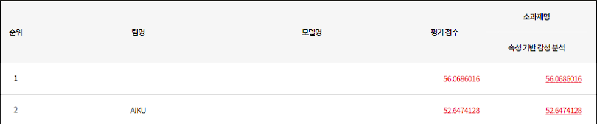

### Analysis

- Dataset의 문제

  - Augmentation을 활용하면 적은 데이터에 대한 문제는 해결해주지만 label간의 불균형 문제는 해결할 수 없음
  - Label의 개수가 지나치게 많음
    - 데이터의 양이 많지 않은데 label이 지나치게 많다보니 각 label에 해당하는 데이터의 개수가 적어짐
    - 실제로 우리가 물건을 구매할 때 고려하는 label이 25개나 되지는 않음

- Task 자체에 대한 정의

  - Category가 아니라 문장 내에 있는 특정 단어에 대해서 감성을 분석하는 방법론도 존재

  - 같은 ABSA task임에도 접근 방법이 다양하다보니 데이터가 적은 상황에서 같이 활용할 수 있는 데이터가 없음

    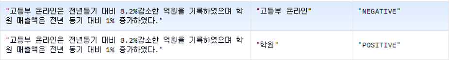